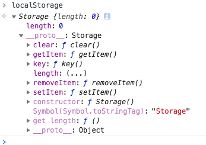
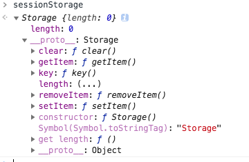

### HTML5 提供了 2 种在客户端存储数据的新方式，挂载在 window 对象中
* sessionStorage：临时保存同一窗口的数据。
* localStorage：没有时间限制的存储

### cookie 与 Web Storage 的区别
cookie：

* cookie 的长度和数量有限制，最大为 4kb
* 当前域中的所有 cookie 都会随请求一起发送到服务器，又从服务器发送回客户端，容易被拦截
* 所有 cookie 都会被请求头发送，存储大量信息会损耗性能

Web Storage：

* 存储字节最大为 5MB
* 仅存储在本地，不会和服务器有任何交集

### 使用
#### 先看一下两个对象的基本数据

### 成员
可以看出两个对象都是通过 Storage 构造函数创建出来的，所以也会共享其中的方法。

1. void setItem(key, value) 添加缓存数据
2. string getItem(key) 获取指定 key 的值
3. void removeItem() 移除指定 key 的 value
4. string key() 获取指定索引的 key
5. void clear() 清空缓存数据
6. readonly length 存储的数据个数

### 示例